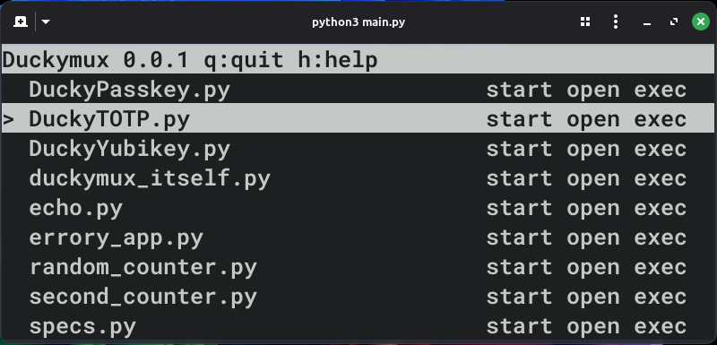

# Duckymux

**DEMO VIDEO : [Demo video](demo.mp4)**\
(also to be clear: you dont type your the letters `^D^X` you press control+D then control+X and the escape sequence is not sent to the app or shown in the screen, in there I just typed to show that thats how you exit)

Duckymux is a tool for the Raspberry Pi Pico (or anything based off of RP2040/2350/ any micropython supported thing) to manage multiple scripts.

## Features
- Full mouse cursor support
  - Click to select, click button to do action
  - Double click to open
  - Right click to run in background without opening
  - `exec` button closes DuckyMux (and all other apps) then runs the app selected.
- Keyboard support (you dont need mouse)
- Run multiple apps at the same time.
- Or, run any one app with full access. (`exec` or `shift+R` )
- Open virtual terminals/serial consoles (`open` or `o`)

## Shortcuts
These only work on the main screen (not on virtual terminals opened with `o`/`open`/doubleclick)
- `h` Show/hide help
- `q` Quit to the REPL, stopping all processes.
- arrows or `j`/`k` (vim-style)/ click: move
- `r`/`start` button/ right click: start an app in the background
- `s`/`stop` button: force-stop an app
- `o`/`open` button/ double click: open a virtual terminal to the app(and start the app if not already started)
Use `^D^X` to exit or `^D^D` to send `^D` in a virtual terminal.
- `shift+R` or `exec` button: run in foreground, instantly killing Duckymux and all other apps. This may help if an app is not working with Duckymux as it gives full permissions to that app.

## Usage
- `git clone` this repo
- (optional) put the apps you need in `apps/` and/or remove the examples
you can also use the example apps
- then run `python3 main.py` (or however you want to run it)
- press h and read the helptext or use the intuitive mouse UI (in a virtual terminal use `^D^X` to exit without stopping or `^D^D` to send the ctrl+d)

### example apps
- DuckyPasskey and DuckeyYubikey - does nothing
- DuckyTOTP - a functional TOTP app, modify `totp.json` if needed
- duckymux_itself.py - demonstrates the advanced functionality, it can even run itself and GUI apps 
- echo.py - echoes what you type in
- errory_app.py - demonstrates error handling
- random_counter and second_counter - they are the same thing, demonstrates terminal persistence and permeance (it will keep running even when you dont look at it and you can see the remaining output when you open it again)
- specs.py - demonstrates API passthrough
- test_app_* - fills the screen to demonstrate scroll

